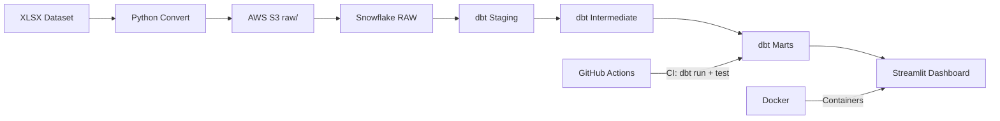

# 🎵 Music Royalty Analytics Platform

End-to-end data pipeline for music royalty analysis built as a portfolio project for a Business Data Analyst interview.

[](https://github.com/RainbowHD/music-royalty-analytics/actions/workflows/dbt_ci.yml)

## 🏗️ Architecture


## 🛠️ Tech Stack

| Layer | Technology |
|---|---|
| Storage | AWS S3 |
| Warehouse | Snowflake |
| Transformation | dbt |
| Dashboard | Streamlit |
| Containerisation | Docker |
| CI/CD | GitHub Actions |

## 📊 Data Model
```
RAW.ROYALTY_TRANSACTIONS        ← exact copy of source CSV
        ↓
STAGING.STG_ROYALTY_TRANSACTIONS   ← cleaned, cast, royalty_rate_pct added
        ↓
INTERMEDIATE.INT_ROYALTIES_BY_STORE ← aggregated by store/format/deal
        ↓
MARTS.MART_LABEL_PERFORMANCE    ← label-level revenue & royalties
MARTS.MART_STORE_BENCHMARKS     ← DSP performance comparison
MARTS.MART_DATA_QUALITY         ← ISRC coverage, data health metrics
```

## 🔑 Key Business Questions Answered

- Which stores generate the highest royalty rate?
- Which labels earn the most royalties?
- What is the ISRC data quality coverage?
- How does revenue compare across DSPs?

## 🚀 Quick Start
```bash
# Clone the repo
git clone https://github.com/RainbowHD/music-royalty-analytics.git
cd music-royalty-analytics

# Set up environment
uv venv --python 3.12
source .venv/bin/activate
uv sync

# Copy and fill in credentials
cp .env.example .env

# Convert and upload data
uv run python data/convert.py
uv run python infra/upload_to_s3.py data/royalties.csv

# Run dbt
cd dbt_music_analytics
uv run dbt run
uv run dbt test

# Run dashboard
cd ../app
uv run streamlit run streamlit_app.py
```

## 📁 Project Structure
```
music-royalty-analytics/
├── .github/workflows/     # GitHub Actions CI/CD
├── dbt_music_analytics/   # dbt project
│   └── models/
│       ├── staging/       # cleaned source data
│       ├── intermediate/  # aggregations
│       └── marts/         # business-ready tables
├── app/                   # Streamlit dashboard
├── infra/                 # AWS Lambda + S3 utilities
├── data/                  # local data (gitignored)
└── docker-compose.yml     # container orchestration
```

## 🎯 Domain Context

This project uses music royalty data from a digital distributor. Key concepts:
- **ISRC** — unique identifier per recording (like a barcode for a track)
- **Royalty Rate** — royalty ÷ value × 100 (varies by store, deal, and format)
- **Deal** — contract type between label and distributor defining payout terms